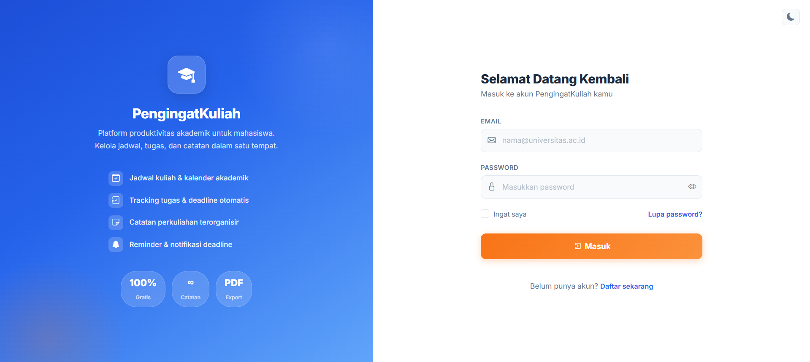
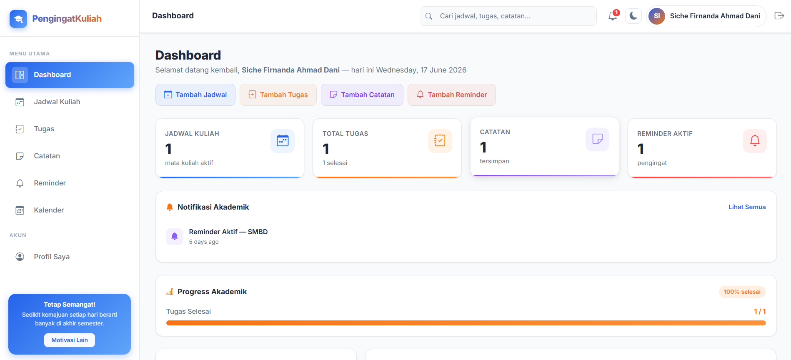
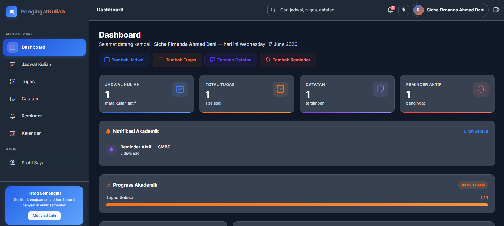
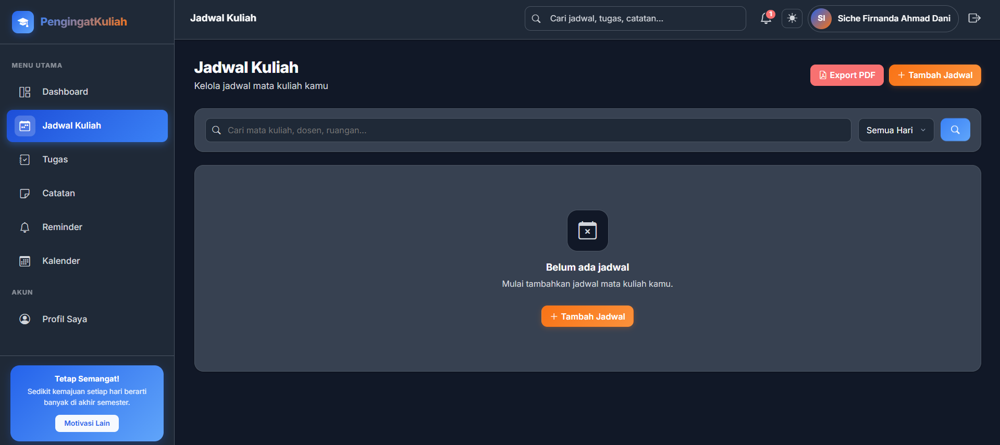
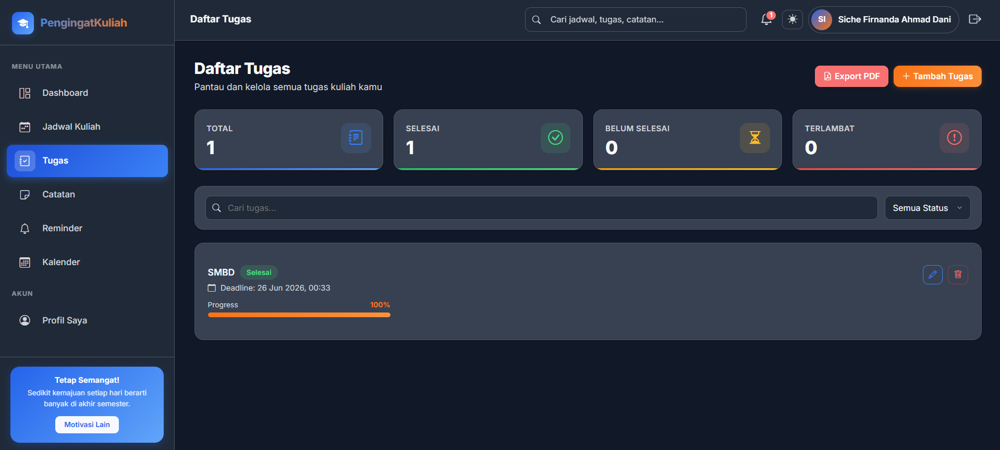

# PengingatKuliah

PengingatKuliah adalah aplikasi manajemen akademik mahasiswa berbasis Laravel 12 yang membantu pengguna mengatur jadwal kuliah, tugas, reminder, dan catatan dalam satu platform modern dan responsive.

---

Features

## Jadwal Kuliah
- Tambah, edit, dan hapus jadwal kuliah
- Tampilan jadwal harian
- Kalender akademik interaktif

## Manajemen Tugas
- Tracking progress tugas
- Status selesai / belum selesai
- Filter & pencarian tugas
- Statistik progress akademik

## Reminder & Notifikasi
- Reminder deadline tugas
- Notifikasi jadwal kuliah
- Reminder otomatis pada dashboard

## Catatan
- Membuat catatan perkuliahan
- Penyimpanan catatan terorganisir

## UI Modern
- Dark / Light mode
- Responsive mobile
- Dashboard modern & aesthetic
- Kombinasi warna orange + blue

---

## Tech Stack

- Laravel 12
- PHP 8+
- MySQL
- Tailwind CSS
- JavaScript
- FullCalendar
- Chart.js

---

## 📸 Screenshots

### Halaman Login

### Light mode Dashboard

### Dark mode Dashboard

### Jadwal

### Tugas

---

Installation

Clone repository:

bash
git clone https://github.com/naannd/pengingatkuliah.git

Masuk ke folder project:

bash
cd pengingatkuliah

Install dependency:

bash
composer install
npm install

Copy file environment:

bash
cp .env.example .env

Generate app key:

bash
php artisan key:generate

Setup database:

bash
php artisan migrate

Run project:

bash
npm run dev
php artisan serve

---

Folder Structure

bash
app/
routes/
resources/
public/
database/

---

Author

*Nanda*

GitHub:
https://github.com/naannd

---

License

This project is licensed under the MIT License.
